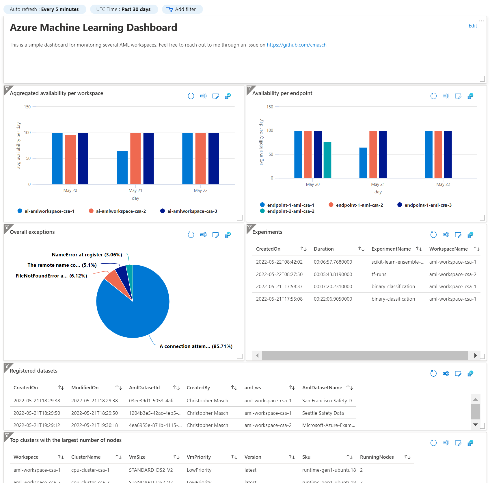
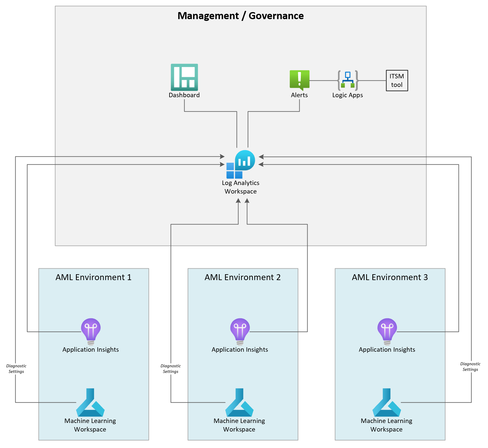

# Azure Machine Learning Workspace - Monitoring & Dashboard
This sample demonstrates how you can monitor several Azure Machine Learning (AML) workspaces. On top of that it creates a dashboard to visualize what's happening in the different AML workspaces.

**Dashboard:** 

If you are familiar with [Kusto Query Language (KQL)](https://docs.microsoft.com/en-us/azure/data-explorer/kusto/query/) you can modify the existing queries or add new ones to get tailored insights.
You can customize the dashboard template by editing `dashboard.json`.

## Infrastructure as Code - Terraform
To automate all the steps for setting up the infrastructure (incl. AML workspaces and monitoring) as well as the dashboard, I implemented everything in Terraform.

If you are new to Terraform, see [Terraform - Azure Get Started](https://learn.hashicorp.com/collections/terraform/azure-get-started)

**Overview of the architecture/infrastructure:** 

I didn't integrate VNet or other governance topics to keep this demo simplified. All AML workspaces are created in their own Resource Group (Rg) within one Subscription.

If you would like to deploy the architecture as represented above (except of Alerts and Logic Apps), you just need to execute the `terraform apply` stmt. Feel free to update `deployment_config.tfvars` to modify the naming, tags and resource specific options.

**Terraform commands & required steps:**

| Steps | Description | Command |
|------|------|------|
| (1) | Initialize the infrastructure | `terraform init` |
| (2) | Inspect changes | `terraform plan -var-file=deployment_config.tfvars` |
| (3) | Deploy / update the infrastructure | `terraform apply -var-file=deployment_config.tfvars` |
| *optional* | Destroy the infrastructure | `terraform destroy -var-file=deployment_config.tfvars` |

If you don't see any data in the dashboard right after deploying the infrastructure, it will take about 10 mins to ingest the first data. You can also inspect the Log Analytics Workspace for any tables. They will be created automatically. Some data (e.g., availability results, registered datasets, experiments) will only be available after performing the necessary operations within AML.
At least the notebook instances should be displayed without any actions in the table at the bottom.

## Monitor Availability of Endpoints
To monitor the availability of the endpoints you have to add tests within Application Insights. This is quite straightforward, see [Monitor availability with URL ping tests](https://docs.microsoft.com/en-us/azure/azure-monitor/app/monitor-web-app-availability).

## References
- [ARM Template for Building a AML Dashboard](https://github.com/Azure/azure-quickstart-templates/tree/master/quickstarts/microsoft.machinelearningservices/machine-learning-workspace-monitoring-dashboard)
- [Monitor Azure Machine Learning](https://docs.microsoft.com/en-us/azure/machine-learning/monitor-azure-machine-learning)
- [Monitoring Azure machine learning data reference](https://docs.microsoft.com/en-us/azure/machine-learning/monitor-resource-reference)
- [Monitor and collect data from ML web service endpoints](https://docs.microsoft.com/en-us/azure/machine-learning/how-to-enable-app-insights)
- [Enterprise monitoring with Azure Monitor](https://docs.microsoft.com/en-us/azure/architecture/example-scenario/monitoring/enterprise-monitoring)

## Disclaimer
The code is published as a demo and you can use it for free on your own. 
Please consider that either Microsoft or myself can officially support this code.
